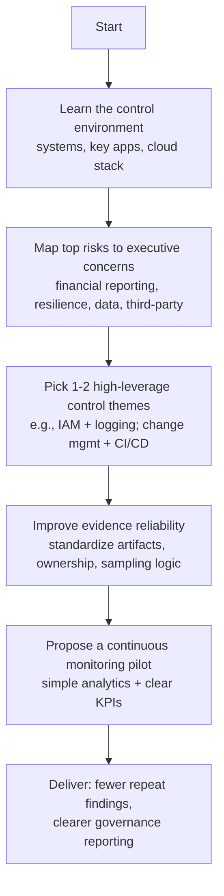

```mermaid
flowchart TB
    P0["Start"] --> P1["Learn the control environment<br/>systems, key apps, cloud stack"]
    P1 --> P2["Map top risks to executive concerns<br/>financial reporting, resilience, data, third-party"]
    P2 --> P3["Pick 1-2 high-leverage control themes<br/>e.g., IAM + logging; change mgmt + CI/CD"]
    P3 --> P4["Improve evidence reliability<br/>standardize artifacts, ownership, sampling logic"]
    P4 --> P5["Propose a continuous monitoring pilot<br/>simple analytics + clear KPIs"]
    P5 --> P6["Deliver: fewer repeat findings,<br/>clearer governance reporting"]
```
