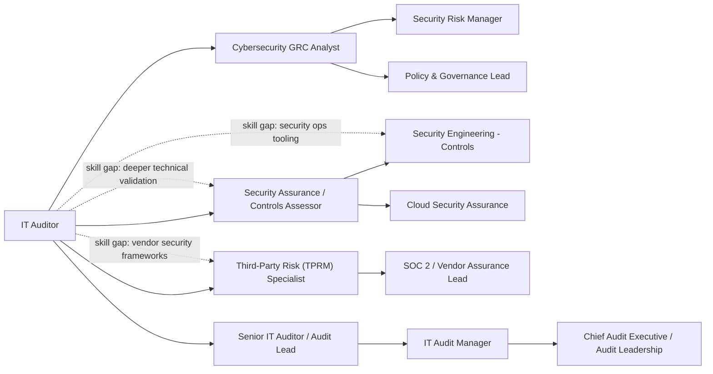

```mermaid
flowchart LR
  A["IT Auditor"] --> B["Senior IT Auditor / Audit Lead"]
  A --> C["Cybersecurity GRC Analyst"]
  A --> D["Security Assurance / Controls Assessor"]
  A --> E["Third-Party Risk (TPRM) Specialist"]

  C --> F["Security Risk Manager"]
  C --> G["Policy & Governance Lead"]
  D --> H["Security Engineering - Controls"]
  D --> I["Cloud Security Assurance"]
  E --> J["SOC 2 / Vendor Assurance Lead"]

  B --> K["IT Audit Manager"]
  K --> L["Chief Audit Executive / Audit Leadership"]

  A -.->|skill gap: deeper technical validation| D
  A -.->|skill gap: security ops tooling| H
  A -.->|skill gap: vendor security frameworks| E
```
